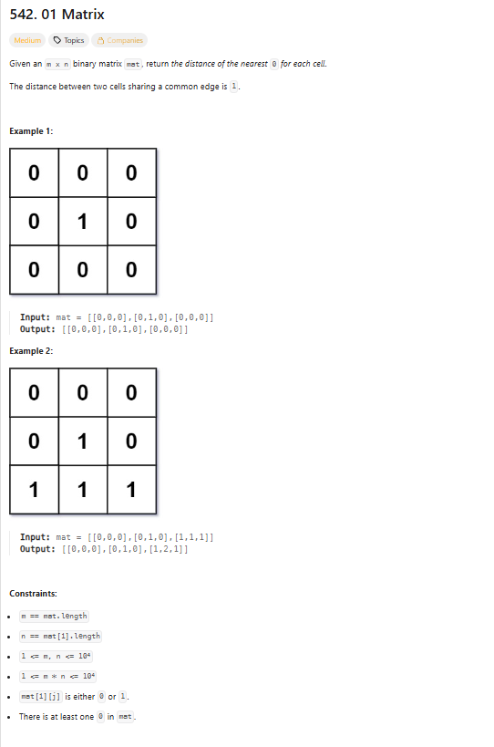
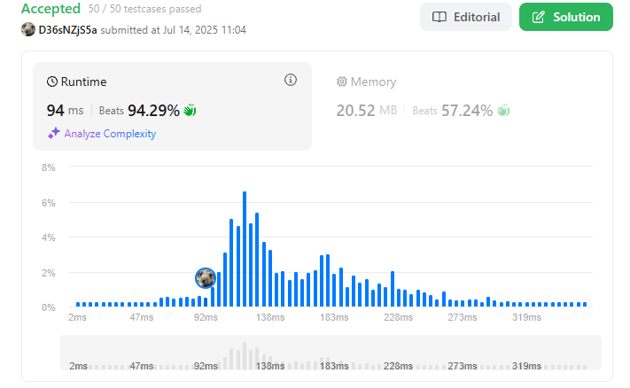
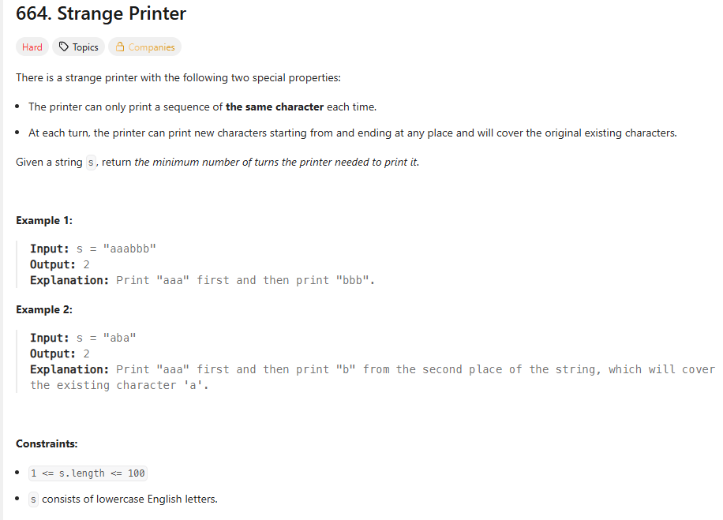
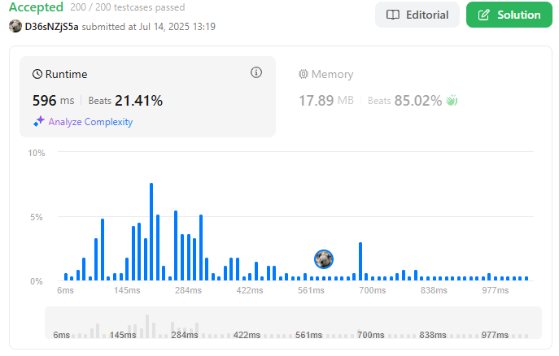
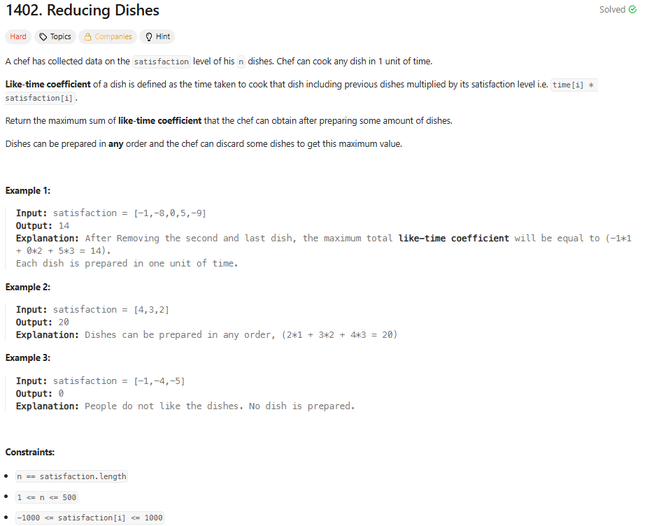
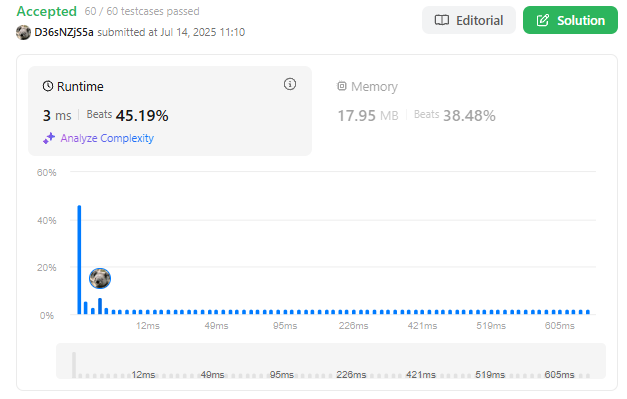

# PD_questoesL

# Exercícios LeetCode

- **Conteúdo da Disciplina**: Programação Dinâmica  
- [**Vídeo da Apresentação**]()  

## Alunos
|Matrícula | Aluno |GitHub|
| -- | -- | -- |
| 19/0102683  | Antônio José Magalhães Leão Júnior |[antonioleaojr](https://github.com/antonioleaojr)|

## Vídeo da Apresentação
Acesse o vídeo das questões [clicando aqui]().

## Sobre 
Este repositório tem como objetivo resolver exercícios sobre programação dinâmica do [LeetCode](https://leetcode.com/problem-list/dynamic-programming/).

|Exercício | Dificuldade |
| -- | -- |
|[542 - 01 Matrix](https://leetcode.com/problems/01-matrix/description)|🟡 Médio|
|[664 - Strange Printer](https://leetcode.com/problems/strange-printer/description)|🔴 Difícil|
|[1402 - Reducing Dishes](https://leetcode.com/problems/reducing-dishes)|🔴 Difícil|

## Screenshots

### Exercício 1 - [01 Matrix]([https://leetcode.com/problems/greatest-sum-divisible-by-three/description/](https://leetcode.com/problems/01-matrix/description))
Resolução em Código: [542](codigos/542.py)

  
<strong>Imagem 1 - Questão 542</strong>

  
<strong>Imagem 2 - Exercício 542 Aceito</strong>

### Exercício 2 - [ Strange Printer]([https://leetcode.com/problems/maximum-number-of-tasks-you-can-assign/description/](https://leetcode.com/problems/strange-printer/description))

Resolução em Código: [664](codigos/664.py)

  
<strong>Imagem 3 - Questão 664</strong>

  
<strong>Imagem 4 - Exercício 664 Aceito</strong>

### Exerício 3 - [Reducing Dishes](https://leetcode.com/problems/reducing-dishes)

Resolução em Código: [1402](codigos/1402.py)

  
<strong>Imagem 5 - Questão 1402</strong>

  
<strong>Imagem 6 - Exercício 1402 Aceito</strong>

## Instalação 
**Linguagem**: Python
- Para os testes e julgamentos automáticos, os códigos devem ser executados no LeetCode.

## Uso 
Entrar no link da questão do LeetCodee, escolher Python e colocar o código para ser submetido aos testes.
  
